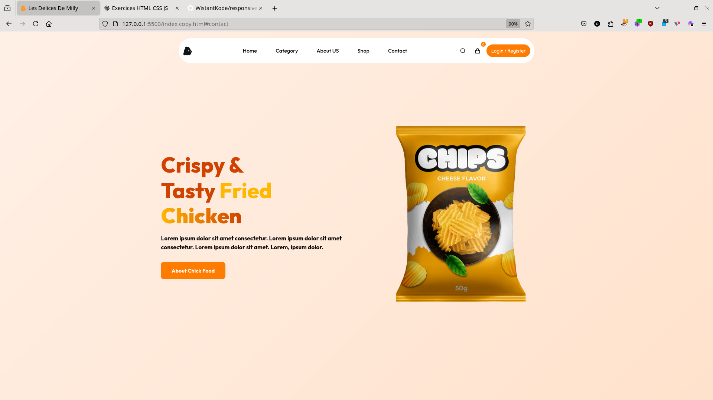

# 🍜 Responsive Food & Coffee Shop Website


---

Un site web de type landing page, moderne et entièrement responsive, pour un commerce alimentaire ( chips). Construit avec HTML, CSS et JavaScript purs, il intègre des animations fluides, des sliders de produits interactifs et une interface utilisateur épurée.

### [ Voir la Démo Live](https://chips-wistant.vercel.app/)

---

## 📸 Aperçu



---

## ✨ Fonctionnalités

- **🎨 Design Moderne & Attrayant :** Une interface utilisateur soignée avec une palette de couleurs chaleureuse.
- **📱 Entièrement Responsive :** Affichage parfait sur tous les appareils, du mobile au grand écran de bureau.
- **🚀 Animations Fluides :** Des animations CSS subtiles sur les titres, les images et les cartes pour une expérience utilisateur dynamique.
- **🎠 Sliders Interactifs :** Carrousels de produits et de partenaires réalisés avec **Swiper.js**.
- **🔍 Effets au défilement :** Apparition progressive des sections et des éléments grâce à **ScrollReveal.js**.
- **🍔 Sections Complètes :** Inclut des sections Accueil, À propos, Produits, Partenaires, Conseils et un pied de page détaillé.
- **🔧 Code Organisé :** Une structure de fichiers claire et un code CSS bien commenté utilisant des variables pour une maintenance facile.

---

## 🚀 Technologies Utilisées

Ce projet est construit exclusivement avec des technologies front-end :

!HTML5
!CSS3
!JavaScript
!Swiper.js
!Bootstrap
!Remix Icon

---

## 📦 Installation et Lancement

Pour obtenir une copie locale du projet et la faire fonctionner, suivez ces étapes simples.

1.  **Clonez le dépôt**
    ```sh
    git clone https://github.com/WistantKode/responsive-ecommerce-chips-website.git
    ```

2.  **Naviguez vers le dossier du projet**
    ```sh
    cd responsive-ecommerce-chips-website
    ```

3.  **Ouvrez le fichier `index.html`**
    Ouvrez simplement le fichier `index.html` (ou `index copy.html`) dans votre navigateur web préféré.

    > **Astuce :** Pour une meilleure expérience de développement, vous pouvez utiliser une extension comme Live Server pour Visual Studio Code, qui rechargera automatiquement la page à chaque modification.

---

## 📁 Structure du Projet

Le projet est structuré de manière intuitive pour faciliter la navigation et la maintenance.

```
Responsivewebsite-chickfood/
├── assets/
│   ├── css/
│   │   └── style.css         # Feuille de style principale
│   ├── images/
│   │   └── ...               # Toutes les images du projet
│   ├── js/
│   │   └── main.js           # Scripts JavaScript principaux
│   │   └── ...               # Autres librairies JS
│   └── logos/
│       └── ...               # Logos des partenaires
├── index.html                # Fichier HTML principal
├── git_push.py               # Script d'automatisation Git
└── README.md                 # Ce que vous lisez actuellement
```

---

## 🤝 Contribution

Les contributions sont ce qui rend la communauté open source un endroit extraordinaire pour apprendre, inspirer et créer. Toute contribution que vous faites est **grandement appréciée**.

1.  Forkez le Projet
2.  Créez votre branche de fonctionnalité (`git checkout -b feature/NouvelleFonctionnalite`)
3.  Commitez vos changements (`git commit -m 'Ajout de NouvelleFonctionnalite'`)
4.  Poussez vers la branche (`git push origin feature/NouvelleFonctionnalite`)
5.  Ouvrez une Pull Request

---

## 📄 Licence

Distribué sous la licence MIT. Voir [le fichier LICENSE](./LICENSE)] pour plus d'informations.

---

## 📬 Contact

**WistantKode** - @WistantKode

Lien du projet : https://github.com/WistantKode/responsive-ecommerce-chips-website.git